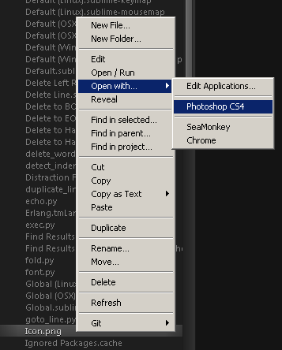

# [Sidebar Enhancements](https://packagecontrol.io/packages/SideBarEnhancements) for [Sublime Text 3](https://www.sublimetext.com/3) [](https://packagecontrol.io/packages/SideBarEnhancements)

* [Documentation](#documentation)
  * [In other languages](#in-other-languages)
* [Requirements](#requirements)
* [Installation](#installation)
  * [Installation via Package Control](#installation-via-package-control)
  * [Manual installation](#manual-installation)
  * [Troubleshooting](#troubleshooting)
* [Description](#description)
* [F12 key](#f12-key)
  * [With absolute paths](#with-absolute-paths)
  * [With relative paths](#with-relative-paths)
    * [F12 key conflict](#f12-key-conflict)
* [Configuration](#configuration)
* [FAQ](#faq)
* [Licensing](#licensing)
  * [License](#license)
  * [External libraries](#external-libraries)
  * [Source code](#source-code)
* [Donations](#donations)

---

## Documentation

### In other languages

* Japanese: <http://taamemo.blogspot.jp/2012/10/sublime-text-2-sidebarenhancements.html?m=1>
* Russian: <https://www.youtube.com/watch?v=8I0dJTd58kI&feature=youtu.be&a>

## Requirements

* Sublime Text 3
  * [Sublime Text 3 stable](https://www.sublimetext.com/3)
  * [Sublime Text 3 dev](https://www.sublimetext.com/3dev)

**Does not work with earlier versions of Sublime Text!**

## Installation

Using **Package Control** is not required, but recommended as it keeps your packages (with their dependencies) up-to-date!

### Installation via Package Control

* [Install Package Control](https://packagecontrol.io/installation#st3)
  * Close and reopen **Sublime Text 3** after having installed **Package Control**.
* Open the [Command Palette](http://docs.sublimetext.info/en/latest/extensibility/command_palette.html) via `Tools > Command Palette` from the main menu.
* Choose `Package Control: Install Package`.
* Search for [`SideBarEnhancements`](https://github.com/titoBouzout/SideBarEnhancements) and select it to install.

### Manual installation

Unpack the contents of the [zip-file](https://github.com/titoBouzout/SideBarEnhancements/archive/st3.zip) into `../sublime/Data/Packages/SideBarEnhancements` where **Sublime Text 3** is installed.

### Troubleshooting

* First please note this package only adds a context menu to the "Folders" section and not to the "Open Files" section.
* Open the package folder via `Main menu / Preferences / Browse Packages`.
* Close Sublime Text.
* Remove the folder `Packages / SideBarEnhancements`
* Remove the folder `User / SideBarEnhancements`
* Navigate one folder up, to `Installed Packages`, check for any instance of SideBarEnhancements and remove it.
* Open ST, with Package Control go to : Remove Package, check for any instance of SideBarEnhancements and remove it.
* Restart ST
* Open ST, check if there is any entry about SideBarEnhancements in Package Control (in sections: "Remove Package" and just in case in "Enable Package")
* Repeat until you find there no entry about SideBarEnhancements
* Restart ST
* Install it.
* It works

## Description

Provides enhancements to the operations on sidebar of files and folders for [Sublime Text 3](http://www.sublimetext.com/3).

Notably provides delete as "move to trash", open with.. and a clipboard.

Close, move, open and restore buffers affected by a rename/move command (even on folders).

Provides the basics: new file/folder, edit, open/run, reveal, find in selected/parent/project, cut, copy, paste, paste in parent, rename, move, delete, refresh....

The not so basic: copy paths as URIs, URLs, content as UTF8, content as <data:uri> base64 (nice for embedding into CSS!), copy as tags img/a/script/style, duplicate.

Preference to control if a buffer should be closed when affected by a deletion operation.

Allows to display "file modified date" and "file size" on statusbar.



## F12 key

> Please note that from version 2.122104 this package no longer provides the key, you need to manually add it to your sublime-keymap file (see next section).

F12 key allows you to open the current file in browser.

`url_testing` allows you to set the url of your local server, opened via F12

`url_production` allows you to set the url of your production server, opened via ALT+F12

### With absolute paths

* Right click any file on sidebar and select: `Project / Edit Projects Preview URLs`
* Edit this file, and add your paths and URLs with the following structure:

```json
{
    "S:/www/domain.tld":{
        "url_testing":"http://testing",
        "url_production":"http://domain.tld"
    },
    "C:/Users/luna/some/domain2.tld":{
        "url_testing":"http://testing1",
        "url_production":"http://productiontld2"
    }
}
```

### With relative paths

Imagine we have a project with the following structure

```text
Project/            # root project folder
│
├── libs/
│
├── public/         # the folder we want to load as "http://localhost/"
│
├── private/
│
└── experimental/   # other folder we may run as experimental/test in another url "http://experimental/"
```

Then we create configuration file:

`Project/.sublime/SideBarEnhancements.json`

with contents:

```json
{
    "public/":{
        "url_testing":"http://localhost/",
        "url_production":"http://domain.tld/"
    },
    "experimental/":{
        "url_testing":"http://experimental/",
        "url_production":"http://domain.tld/"
    },
    "":{
        "url_testing":"http://the_url_for_the_project_root/",
        "url_production":"http://the_url_for_the_project_root/"
    }
}
```

You can create config files `some/folder/.sublime/SideBarEnhancements.json` anywhere.

#### F12 key conflict

On Sublime Text 3 `F12` key is bound to `"goto_definition"` command by default. This package was conflicting with that key, this no longers happens. You need to manually add the keys now: Go to `Preferences -> Package Settings -> Side Bar -> Key Bindings - User` and add any of the following:

```json
[
    { "keys": ["f12"],
        "command": "side_bar_open_in_browser" ,
        "args":{"paths":[], "type":"testing", "browser":""}
    },
    { "keys": ["alt+f12"],
        "command": "side_bar_open_in_browser",
        "args":{"paths":[], "type":"production", "browser":""}
    },
    {
        "keys": ["ctrl+t"],
        "command": "side_bar_new_file2"
    },
    {
        "keys": ["f2"],
        "command": "side_bar_rename"
    },
]
```

## Configuration

Definitions file: `User / SideBarEnhancements / Open With / Side Bar.sublime-menu` (note the extra subfolder levels). To open it, right-click on any file in an open project and select `Open With / Edit Applications ...`

- On OSX, the 'application' property simply takes the *name* of an application, to which the file at hand's full path will be passed as if with `open ...`, e.g.: "application": "Google Chrome"
- On OSX, invoking *shell* commands is NOT supported.

```json
//application 1
{
    "caption": "Photoshop",
    "id": "side-bar-files-open-with-photoshop",
    "command": "side_bar_files_open_with",
    "args": {
        "paths": [],
        "application": "Adobe Photoshop CS5.app", // OSX
        "extensions":"psd|png|jpg|jpeg",  //any file with these extensions
        "args":[]
    },
    "open_automatically": true // will close the view/tab and launch the application
}
```

## FAQ

> Why the menu is not shown on `Open Files`?

It should be mentioned that the package's context menu is only available for files and folders **in a project (section `Folders` in the side bar)**, and *not* on the open files listed at the top of the side bar, due to a limitation of ST.

> Can the package stop "show preview in a **right** click to a file".

No, ​I'm sorry, can't figure out how to prevent it.

## Licensing

### License

see [`LICENSE`](LICENSE)

### External libraries

> Check each license in project pages.

* [bfg-pages](http://code.google.com/p/bfg-pages): "getImageInfo" to get width and height for images
* [desktop](http://pypi.python.org/pypi/desktop): to be able to open files with system handlers
* [send2trash](http://pypi.python.org/pypi/Send2Trash): to be able to send to the trash instead of deleting forever
* [hurry.filesize](http://pypi.python.org/pypi/hurry.filesize): to be able to format file sizes
* [Edit.py](http://www.sublimetext.com/forum/viewtopic.php?f=6&t=12551): ST2/3 edit abstraction

### Source code

* <https://github.com/titoBouzout/SideBarEnhancements>
* See [this forum thread](https://forum.sublimetext.com/t/sidebar-enhanc-clipboard-open-with-reload-renamed/2784) for plug-in announcement.
* [`CONTRIBUTORS.md`](docs/CONTRIBUTORS.md)
* [TODO](https://github.com/titoBouzout/SideBarEnhancements/issues/223)
* [`CHANGELOG.md`](docs/CHANGELOG.md)

## Donations

[Donations](https://www.paypal.com/cgi-bin/webscr?cmd=_s-xclick&hosted_button_id=TS3PCN4BHH244) to support this project are gladly accepted.
